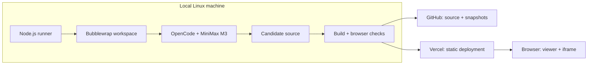
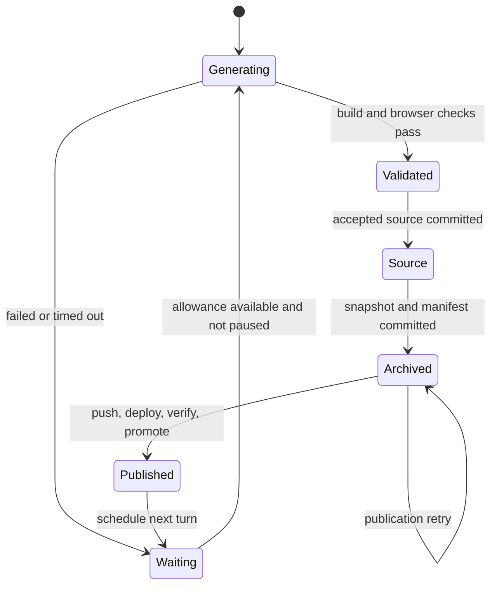

# How to build a continuously evolving website

This project gives a coding model the same request repeatedly, publishes each working result, and lets visitors revisit every version. This document explains how the pieces fit together, with pointers to the actual implementation. You should be able to follow it with basic JavaScript, Git, and web development knowledge.

## 1. Separate the page from the machine that changes it

There are three programs with different jobs:

| Program | Where it runs | What it does |
| --- | --- | --- |
| Viewer | Visitor's browser | Shows an archived page and the timeline controls |
| Experiment | An iframe in that browser | Runs the HTML, CSS, and JavaScript MiniMax created |
| Runner | This Linux machine | Invokes the model, validates changes, commits, deploys, and waits |

The viewer is a React application built with Vite. TanStack Router manages its URL and the `iteration` search parameter. It is client-only: Vercel serves static files, and the browser does the rendering. The runner is a separate Node.js process. It does not run inside Vercel, a browser tab, or a GitHub Action.



The model cannot edit the timeline or the publisher. This is what lets the generated page change radically without losing the ability to browse its history.

## 2. Start with a reproducible seed

The initial experiment consists of a black background and the exact title “is Minimax M3 good at frontend yet?” The title also appears in `experiment/index.html` as the document title.

The relevant files are:

```text
src/                         Viewer source
experiment/src/              Current accepted experiment source
experiment/public/           Current experiment's local assets
runner/prompt.md              The repeated development instruction
runner/config.json           Model, cadence, allowances, project URL
public/iterations/000000/     Built seed and screenshots
public/manifest.json          Ordered list of preserved versions
.runner/                     Private local state and attempt logs; ignored by Git
```

`npm run seed` builds the initial page, opens it in Chromium, captures desktop and mobile screenshots, and records it as iteration 0. Running the command again does not replace that snapshot.

Source code and a built website are different things. Source includes TypeScript and imports. A production build turns those into browser-ready HTML, JavaScript, CSS, and assets. Keeping the built files means an old page can run without reinstalling its dependencies or rebuilding its source years later.

## 3. Give the model a fresh workspace each turn

[`runner/index.mjs`](../runner/index.mjs) coordinates a turn. It first checks the pause marker, daily allowances, clean Git state, and archive size. It pulls remote changes with `git pull --ff-only`, which brings in ordinary remote updates without rewriting local history. Diverged branches require a human to resolve them.

Next it copies `experiment/` into an attempt directory:

```text
.runner/attempts/000002-<unique-id>/
  work/                  Candidate project
  home/                  Isolated OpenCode settings and state
  artifacts/             Screenshots from validation
  opencode.jsonl         Private structured event log
  opencode.stderr.log    Private diagnostic log
```

The unique suffix distinguishes failed attempts at the same iteration number. Failed candidates never overwrite the accepted experiment.

Each invocation starts a new OpenCode session. The request in `runner/prompt.md` stays the same. The changing context is the copied source and a small `ITERATION_CONTEXT.md` file listing recent changes. The model therefore builds on the previous page without accumulating an unlimited chat history. The prompt's SHA-256 hash is stored with each snapshot so changes to the experimental instruction can be detected.

The essential invocation is:

```sh
opencode run --pure --model minimax-coding-plan/MiniMax-M3 --format json '<fixed prompt>'
```

The real implementation passes the prompt as a subprocess argument rather than assembling an executable shell string. This prevents punctuation in the prompt from becoming shell commands. `--pure` avoids external OpenCode plugins, and JSON output gives the runner structured completion, error, and usage events.

## 4. Understand the two sandboxes

There is one boundary while generating code and another while displaying it. They solve different problems.

### The Linux workspace boundary

[`runner/sandbox.mjs`](../runner/sandbox.mjs) launches OpenCode through Bubblewrap, a Linux tool that gives a process its own filesystem view and process namespace.

| Location inside the sandbox | Access |
| --- | --- |
| `/work/src/` and `/work/public/` | Writable candidate files |
| `/work/package.json`, build configuration, `src/main.tsx` | Read-only bind mounts |
| `/work/node_modules` | Read-only installed dependencies |
| `/home/agent` | Private OpenCode runtime directory for this attempt |
| `/usr`, `/etc`, Node, OpenCode executable | Read-only runtime files |
| Host home, Git repo, GitHub and Vercel credentials | Not mounted |

A bind mount exposes an existing file or directory at another location. A read-only bind mount lets the process read it but prevents writes. The candidate has only the MiniMax provider credential; the publishing credentials stay with the outer runner. The copied provider credential is removed after a normally completed or failed turn. A forcibly killed process may leave private runtime files behind, so `.runner/` must remain out of Git.

The sandbox shares the host network so OpenCode can reach MiniMax's API. It is **not** a network isolation mechanism. The prompt disallows external page dependencies, and browser validation also blocks them. On this machine, `/etc/resolv.conf` points to a file under `/run`; that target must be mounted too, or DNS fails inside the sandbox even though networking is available.

Vite's usual config loader writes a temporary file into `node_modules`. We use `--configLoader native` for the experiment so builds work with read-only dependencies. This is a good example of adapting normal development tools to an isolated environment.

After the model finishes, the outer runner checks protected-file hashes and rejects unexpected files and symlinks. It then builds the candidate inside the sandbox again. A successful exit from the model is not accepted as proof of a working build.

### The browser boundary

The viewer embeds a selected snapshot using:

```html
<iframe sandbox="allow-scripts" src="/iterations/000002/index.html"></iframe>
```

Scripts may run, but the iframe does not receive `allow-same-origin`. It gets an opaque origin, so its code cannot access the parent viewer's document or storage. Top-level navigation, popups, and forms are not enabled.

Because JavaScript modules inside that iframe need to load their own files, snapshot responses include `Access-Control-Allow-Origin: *`. A Content Security Policy permits local scripts, styles, images, and fonts while disallowing external connections and form submission. The same restrictions are exercised by the local validation server.

These measures fit a small frontend experiment. They are not a claim that arbitrary hostile code can be run safely on any machine. A multi-user product would need stronger resource isolation and network controls.

## 5. Validate before accepting a page

[`runner/browser.mjs`](../runner/browser.mjs) starts a temporary HTTP server and uses Playwright to drive Chromium. For each candidate, the runner checks:

1. TypeScript and Vite production build succeed.
2. Protected files are unchanged and permitted page source actually changed.
3. The exact document title and visible title remain present.
4. The page loads without uncaught JavaScript errors or missing local resources.
5. The page does not depend on external requests.
6. Desktop and mobile pages do not overflow horizontally.
7. The built snapshot and total archive fit their size allowances.

Screenshots are captured at 1440 × 760 and 390 × 844 with reduced motion enabled. They provide stable previews, but they are not a substitute for the archived interactive app.

There is deliberately no “is this beautiful?” gate. A visually strange result belongs in the experiment if it passes the technical checks. These checks also do not prove full accessibility or that every possible interaction works.

## 6. Commit source, then commit the archive

A valid candidate replaces the accepted files in `experiment/`. The runner creates a source commit, then constructs its snapshot:

```text
public/iterations/000002/
  index.html
  assets/...
  desktop.png
  mobile.png
  metadata.json
```

Vite builds with `base: './'`. This makes asset URLs relative to the snapshot's directory, so version 2 loads version 2's assets rather than the newest app's files.

The metadata records the iteration number, parent, model identifier, prompt hash, source commit, duration, available usage, and a short summary. `public/manifest.json` adds the same record to its ordered list.

The archive gets a second commit. Two commits avoid a circular reference: the metadata can reference a source commit that already exists. A file cannot meaningfully contain the final hash of the very commit that contains it, because changing the file changes that hash.

Then both commits are pushed to GitHub. GitHub is the durable store for source, screenshots, and build artifacts here. GitHub Actions artifacts are not used, and visitors do not load raw GitHub URLs. Vercel serves the checked-in snapshots as normal static files.

## 7. Deploy first, promote second

[`runner/publish.mjs`](../runner/publish.mjs) builds the viewer and prepares Vercel's static Build Output directory:

```text
.vercel/output/
  config.json       Static routing and response headers
  static/           Viewer, manifest, and every archived snapshot
```

The publisher then runs:

```sh
vercel deploy --prebuilt --prod --skip-domain --yes
```

`--prebuilt` uploads the prepared output. `--skip-domain` allows checking the deployment before moving the designated live domain. The new deployment has its own URL. The runner fetches its manifest and opens its viewer in Chromium, including the selected iframe. It retries briefly while the deployment propagates.

After those checks pass, it runs:

```sh
vercel promote <deployment-url> --yes
```

Finally it checks the public URL too. Successful promotion switches the viewer, manifest, and snapshots together. Visitors never receive a manifest pointing at a snapshot that has not been uploaded yet.

Git-triggered auto-deployments are disabled for this project. Otherwise a Git push could publish a second deployment outside this validation sequence.

## 8. Make restarts boring

An unattended process will eventually stop halfway through something. The runner records progress in `.runner/state.json` using a temporary file followed by a rename. The rename prevents readers from seeing half-written JSON.



The persisted pending stages are `validated`, `source`, and `archived`. On restart, a pending candidate is finished before another model turn begins. Its unique snapshot directory is reused; existing metadata is checked before proceeding. A failed deployment therefore does not cause the model to create a different design on its next retry.

There are still small crash windows. For example, if Vercel creates a deployment and the process dies before saving its URL, a retry may create another deployment of the same artifact. This implementation preserves the iteration and public content; it does not promise exactly one external API call per iteration.

A lock directory records the worker PID. A second worker refuses to run while that process is alive. Stale locks can be recovered after a crash. Git also acts as a consistency check: the publisher refuses an unexpectedly dirty tree or changed HEAD while a publication is pending.

## 9. Wait, then repeat

After publication, the runner targets the next start for 15 minutes after the previous turn began. Generation, validation, and deployment all count toward that interval. If they take longer than 15 minutes, the next turn can begin immediately after publication. The loop sleeps in short intervals and checks for pause markers and allowances. It does not start overlapping model turns, so a slow response delays publication rather than creating concurrent work.

Defaults are in [`runner/config.json`](../runner/config.json):

| Setting | Default | Purpose |
| --- | --- | --- |
| Interval | 15 minutes between starts | Controls the experiment's pace, including generation time |
| Turn timeout | 18 minutes | Bounds a stuck model process |
| Daily model runs | 96 per UTC day | Allows a full day at the target cadence |
| Reported daily cost | $10 | Stops new turns when reported usage reaches it |
| Consecutive failures | 20 | Tolerates extended provider outages before pausing |
| Snapshot / archive allowance | 12 MB / 10 GB | Supports multi-week runs while retaining a deliberate upper bound |

Cost reports may be zero for subscription providers. The cost allowance is checked between turns and is not a hard provider billing cap. Time and run-count limits still apply. Failed turns back off, and a successful publication clears the failure counter.

`npm run service:start` uses `systemd-run --user` to launch a background service on this machine. Systemd supervises the process and collects logs. Closing a terminal does not stop the service. This is a transient unit: after a reboot, start it again. The machine must be awake for development to continue; the website stays online while it is asleep.

## 10. Browse history without restarting the system

[`src/viewer.tsx`](../src/viewer.tsx) fetches the manifest every minute. It loads only the selected interactive iframe and a small set of screenshot previews, rather than starting every archived application at once.

- No `iteration` parameter means follow the latest published version.
- `?iteration=2` fixes the selection to version 2, including after a refresh.
- While dragging, the viewer shows a screenshot; on release it loads the interactive page.
- Publishing a new version does not move someone who is browsing an older version.
- The floating dock keeps navigation accessible while the page fills the canvas.

The expanded view provides more room, but the iframe can still scroll if an iteration grows into a long page. We preserve the generated layout rather than silently clipping its content.

## Build your own version in this order

First make one page and a static viewer with two local snapshots. Prove that asset paths and iframe isolation work. Next automate a single model turn into a temporary directory and reject broken builds. Add screenshots and immutable snapshot directories, then Git commits and a deployment check. Only after that should you add repetition, checkpoint recovery, allowances, and a background service.

The important step is making **one whole cycle** reliable before repeating it. A loop multiplies the behavior you already have, including mistakes.

## Useful commands and places to look

```sh
npm run status                 # Pending phase, last publication, usage, last error
npm run pause                  # Let active work finish, then wait
npm run resume                 # Allow the worker to continue
npm run service:stop           # Stop immediately
npm run publish                # Resume a pending publication with the service stopped
journalctl --user -u is-minimax-good-at-coding-yet -f
```

For a broken model turn, inspect its private files under `.runner/attempts/`. For a failed upload or promotion, inspect `.runner/state.json` and the Vercel deployment URL recorded there. For timeline problems, inspect `public/manifest.json`, the browser console, and the selected snapshot's relative asset paths. Never commit the runtime directory, credentials, or raw private logs while debugging.
